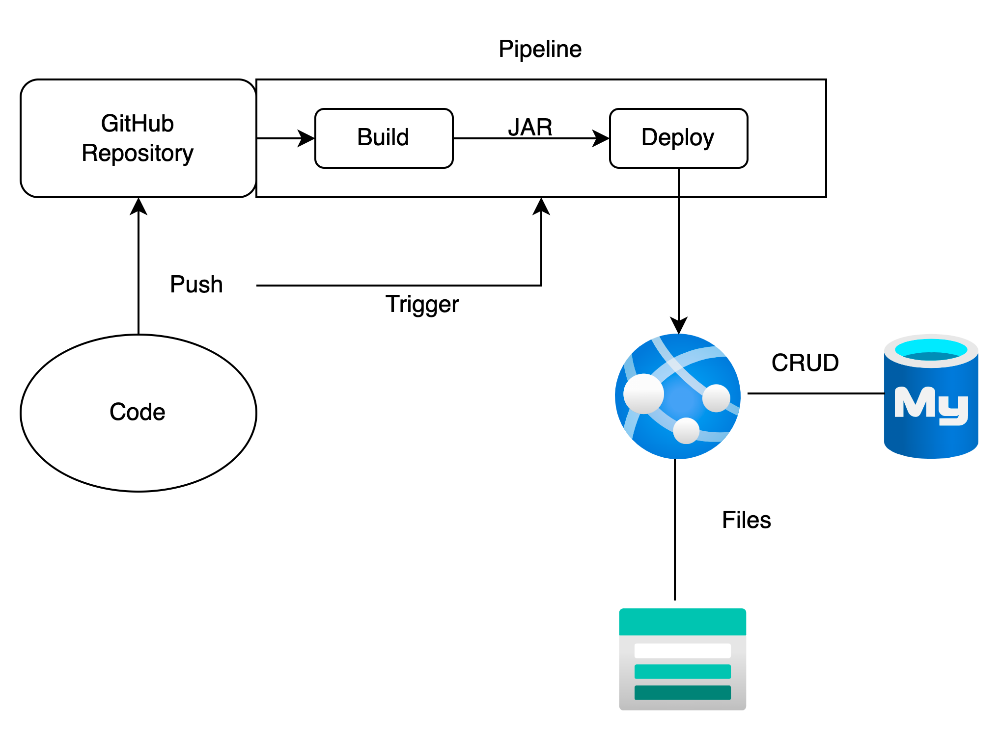

# pet-hospical-backend
软件开发实践课程设计后端

搭建了CI/CD pipeline 到 Azure App Service，向main branch push代码会直接部署到服务器，可以在github的action界面查看构建情况（https://github.com/3ummerW1nd/pet-hospical-backend/actions）
### **push代码到main branch的代码请不要使用本地调试使用的数据库配置**

swagger页面请访问

可以根据这个图来理解

